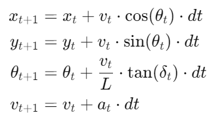

# Model Predictive Control (MPC) for CARLA Simulator

This project implements a Model Predictive Controller (MPC) to control a vehicle in the CARLA simulator. The controller is designed to follow a reference trajectory and optimally control the vehicle's steering, throttle, and braking. The vehicle model is based on kinematic bicycle model equations and the MPC optimization problem is solved using the CasADi library.

## Features

- Real-time vehicle simulation in CARLA.
- MPC controller using CasADi for optimization.
- Visualization of the vehicle's trajectory in CARLA.
- Logging of vehicle states and control inputs for analysis.
- Use control inputs from previous steps if solver can't solve a problem

## Installation

To set up the project, follow these steps:

1. **Install CARLA Simulator**
   - Download and install CARLA Simulator from the [official website](https://carla.org/) or [directly from GitHub releases page of Carla project](https://github.com/carla-simulator/carla/releases)
   - Start the CARLA server:
     ```bash
     ./CarlaUE4.exe
     ```

2. **Install Python Dependencies**
   - Install Python 3.7. It's important! Unfortunately, CARLA doesn't work with other Python versions.
   - Install the required dependencies:
     ```bash
     pip install -r requirements.txt
     ```

## Project Structure

- `src/`: Contains the source code for the project.
  - `carla_simulator.py`: Controls interaction with CARLA (vehicle spawning, trajectory visualization, control application).
  - `config.py`: Configuration file containing vehicle and MPC parameters.
  - `help_functions.py`: Various functions for work with trajectories
  - `logger.py`: Logs vehicle data and control inputs.
  - `main.py`: Main script, which run simulation
  - `mpc_controller.py`: Implements the MPC using CasADi.
  - `vehicle_model.py`: Contains the kinematic bicycle model used in the MPC.

## Usage

1. **Running the Simulation**
   MPC controller uses pre-defined settings. To start the simulation with the MPC controller:

   ```bash
   python main.py
   ```

   This will launch the CARLA simulation, spawn the vehicle, and start the MPC controller to follow a figure-eight trajectory.

2. **Adjusting the Controller Parameters**
   The controller's behavior can be modified by changing parameters in `config.py`:

   - **MPC Horizon (`N`)**: The number of steps the MPC looks ahead.
   - **Control Sample Time (`dt`)**: Time between control updates.
   - **Fine Coefficients**: Penalties for deviating from the trajectory and rapid control changes.

   Example:
   ```python
   N = 5  # Prediction horizon
   dt = 0.1  # Sample time
   FINE_V_COEF = 20  # Fine for speed deviation
   ```

## Mathematical Model

The kinematic bicycle model is used to represent the vehicle dynamics:

- **State Variables**:
  - \(x\): Vehicle's x position
  - \(y\): Vehicle's y position
  - \(theta\): Heading angle
  - \(v\): Speed

- **Control Inputs**:
  - \(delta\): Wheels deviation angle [-MAX_CONTROL_WHEEL_ANGLE_RAD MAX_CONTROL_WHEEL_ANGLE_RAD]
  - \(a\): Acceleration [-MAX_CONTROL_BRAKING_M_S_2 MAX_CONTROL_ACCELERATION_M_S_2]

The model updates the vehicle's state using the following equations:



where \(L\) is the vehicle's wheelbase.

## Visualization

The controller logs various data, including the vehicle's position, speed, and control inputs. After the simulation, the `Logger` class can be used to visualize these logs:

```python
logger.show_plots()
```

This will display plots of the vehicle's trajectory, speed, and control inputs (steering, throttle, and brake) over time.

## Contributions

Feel free to open issues or submit pull requests if you would like to contribute to this project.
